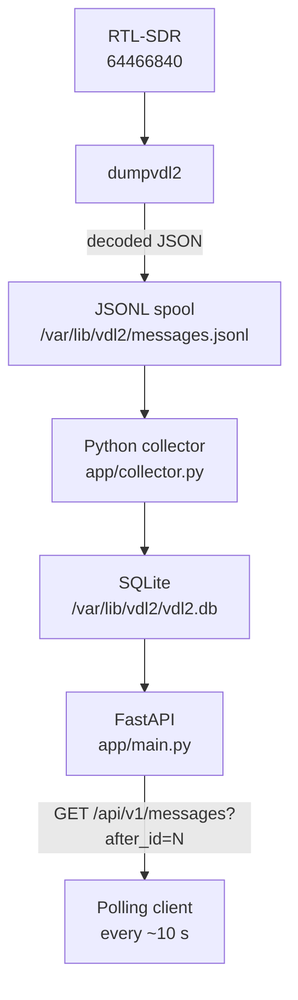
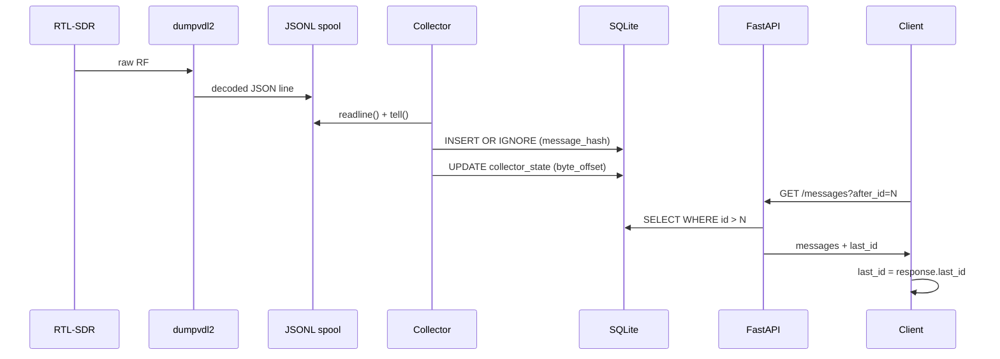

# VDL2 API

A lightweight Python service for Raspberry Pi that collects decoded VDL Mode 2 messages from `dumpvdl2`, stores them in SQLite, and exposes them through a REST API.

---

## Architecture



---

## Requirements

- Raspberry Pi (or any Linux host) running Raspberry Pi OS / Debian
- Python 3.11+
- `dumpvdl2` 2.7.0 with `libacars` 2.2.1
- RTL-SDR (Nooelec NESDR SMArt v5, serial `64466840`)

---

## Installation

### 1. Create a dedicated user and data directory

```bash
sudo useradd -r -s /usr/sbin/nologin vdl2
sudo mkdir -p /var/lib/vdl2
sudo chown vdl2:vdl2 /var/lib/vdl2

# Allow the vdl2 user to access the RTL-SDR device
sudo usermod -aG plugdev vdl2
```

### 2. Install the application

```bash
sudo mkdir -p /opt/vdl2-api
sudo chown vdl2:vdl2 /opt/vdl2-api

# Clone or copy the repository
git clone https://github.com/disappointingsupernova/vdl2-api /opt/vdl2-api
cd /opt/vdl2-api

# Create a virtual environment and install dependencies
python3 -m venv venv
venv/bin/pip install -r requirements.txt
```

### 3. Configure the environment

```bash
sudo cp /opt/vdl2-api/.env.example /opt/vdl2-api/.env
sudo chown vdl2:vdl2 /opt/vdl2-api/.env
sudo chmod 640 /opt/vdl2-api/.env
# Edit as required
sudo nano /opt/vdl2-api/.env
```

Key variables:

| Variable | Default | Description |
|---|---|---|
| `VDL2_API_HOST` | `0.0.0.0` | Bind address |
| `VDL2_API_PORT` | `5001` | HTTP port |
| `VDL2_DATABASE` | `/var/lib/vdl2/vdl2.db` | SQLite database path |
| `VDL2_SPOOL` | `/var/lib/vdl2/messages.jsonl` | dumpvdl2 JSONL output |
| `VDL2_RETENTION_DAYS` | `30` | Message retention period |
| `VDL2_CORS_ORIGINS` | _(empty)_ | Comma-separated allowed CORS origins |

### 4. Install systemd units

```bash
sudo cp /opt/vdl2-api/systemd/dumpvdl2.service /etc/systemd/system/
sudo cp /opt/vdl2-api/systemd/vdl2-api.service /etc/systemd/system/
sudo systemctl daemon-reload
```

### 5. Enable and start the services

```bash
# Start dumpvdl2 first so the spool file is created
sudo systemctl enable --now dumpvdl2.service

# Start the API and collector
sudo systemctl enable --now vdl2-api.service
```

### 6. Verify

```bash
sudo systemctl status dumpvdl2.service
sudo systemctl status vdl2-api.service
journalctl -u vdl2-api.service -f
```

---

## API reference

Interactive documentation is available at:

```
http://<host>:5001/docs
http://<host>:5001/openapi.json
```

### Polling pattern

The intended client algorithm uses a persistent cursor:

```
last_id = 0

every 10 seconds:
    GET /api/v1/messages?after_id=<last_id>
    process all returned messages
    last_id = response.last_id
```

Messages are never deleted because a client has not fetched them. The cursor is a database `id`, not a timestamp window.

---

### `GET /api/v1/messages`

Return messages with `id > after_id`.

| Parameter | Type | Default | Description |
|---|---|---|---|
| `after_id` | int | `0` | Cursor — return messages after this id |
| `limit` | int | `500` | Max messages to return (max 5000) |
| `since` | string | — | ISO 8601 UTC lower bound on `received_at` |
| `until` | string | — | ISO 8601 UTC upper bound on `received_at` |
| `icao` | string | — | Filter by source or destination ICAO |
| `frequency` | int | — | Filter by frequency in Hz |

```bash
curl "http://adsb-pi:5001/api/v1/messages?after_id=18452&limit=1000"
```

```json
{
  "messages": [
    {
      "id": 18453,
      "timestamp": "2026-08-16T16:24:09.000Z",
      "timestamp_ms": 1786897449000,
      "ingested_at": "2026-08-16T16:24:09.181Z",
      "station_id": "adsb-pi",
      "frequency_hz": 136975000,
      "source": { "icao": "4CADF7", "type": "Aircraft" },
      "destination": { "icao": "1099CA", "type": "Ground station" },
      "direction": "downlink",
      "message_type": "H1",
      "aircraft_registration": "EIEXS",
      "flight_id": "EI501",
      "message_text": "#DFB/WRG POSRPT",
      "raw": {}
    }
  ],
  "count": 1,
  "first_id": 18453,
  "last_id": 18453,
  "has_more": false
}
```

---

### `GET /api/v1/messages/latest`

Return the newest N messages.

```bash
curl "http://adsb-pi:5001/api/v1/messages/latest?limit=50"
```

---

### `GET /api/v1/aircraft/{icao}/messages`

Messages for a specific aircraft. ICAO is canonicalised to uppercase.

```bash
curl "http://adsb-pi:5001/api/v1/aircraft/4CADF7/messages?limit=100"
```

---

### `GET /api/v1/aircraft`

Aircraft observed recently.

```bash
curl "http://adsb-pi:5001/api/v1/aircraft?hours=24"
```

```json
{
  "aircraft": [
    {
      "icao": "4CADF7",
      "first_seen": "2026-08-16T15:52:02.000Z",
      "last_seen": "2026-08-16T16:24:15.000Z",
      "message_count": 37,
      "registration": "EIEXS",
      "flight_id": "EI501"
    }
  ]
}
```

---

### `GET /api/v1/health`

```bash
curl "http://adsb-pi:5001/api/v1/health"
```

```json
{
  "status": "ok",
  "database": "ok",
  "collector": "ok",
  "last_message_at": "2026-08-16T16:24:15.000Z",
  "last_message_age_seconds": 3.1,
  "total_messages": 18454
}
```

---

### `GET /api/v1/stats`

```bash
curl "http://adsb-pi:5001/api/v1/stats"
```

```json
{
  "messages_total": 18454,
  "messages_last_minute": 32,
  "messages_last_hour": 1678,
  "messages_by_frequency": {
    "136725000": 182,
    "136775000": 401,
    "136825000": 307,
    "136875000": 855,
    "136975000": 16709
  },
  "unique_aircraft_last_hour": 141
}
```

---

## Running tests

```bash
cd /opt/vdl2-api
venv/bin/python -m pytest -v
```

---

## Project layout

```
/opt/vdl2-api/
├── app/
│   ├── main.py          # FastAPI application, lifespan, CORS
│   ├── config.py        # Pydantic settings (VDL2_* env vars)
│   ├── database.py      # SQLite connection, schema, WAL mode
│   ├── models.py        # Shared query helpers
│   ├── schemas.py       # Pydantic response models
│   ├── collector.py     # JSONL spool tailer, checkpoint, retention
│   ├── parser.py        # dumpvdl2 JSON field extraction
│   └── routes/
│       ├── messages.py
│       ├── aircraft.py
│       ├── stats.py
│       └── health.py
├── systemd/
│   ├── dumpvdl2.service
│   └── vdl2-api.service
├── tests/
│   ├── fixtures/
│   │   └── sample_messages.jsonl
│   ├── test_database.py
│   ├── test_parser.py
│   ├── test_collector.py
│   └── test_api.py
├── .env.example
├── requirements.txt
└── README.md
```

---

## Data flow and reliability



Key reliability properties:

- The collector checkpoints its byte offset after every line, so a restart resumes exactly where it left off.
- `INSERT OR IGNORE` on `message_hash` prevents duplicates if the spool is replayed.
- The API cursor is a monotonically increasing database `id`, not a timestamp. A client that stops polling for an hour simply resumes from its last `last_id`.
- Messages are retained for 30 days (configurable) regardless of whether any client has fetched them.

---

## Upgrading dumpvdl2

The raw dumpvdl2 JSON is stored verbatim in `raw_json`. If a new version of dumpvdl2 adds fields, they are automatically preserved without any schema change to the application.
