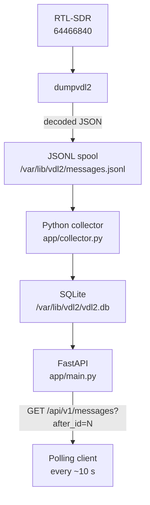
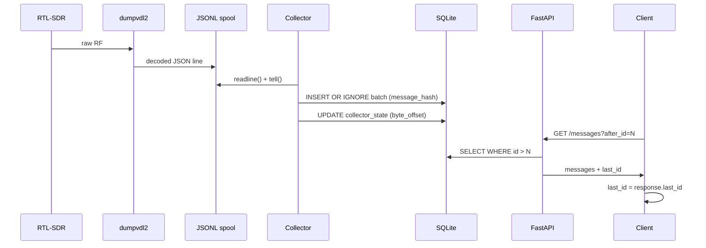

# VDL2 API

> A lightweight Python service for Raspberry Pi that collects decoded VDL Mode 2 aviation messages from `dumpvdl2`, stores them persistently in SQLite, and exposes them through a REST API.


---

## What is VDL Mode 2?

VDL Mode 2 (VHF Digital Link Mode 2) is a digital datalink protocol used by commercial aircraft to exchange operational messages with ground stations over VHF radio. It carries ACARS messages (position reports, weather, clearances), CPDLC (Controller–Pilot Data Link Communications), ADS-C position reports, and other aviation data. It operates on frequencies between 136 and 137 MHz and is receivable with an inexpensive RTL-SDR dongle and the open-source `dumpvdl2` decoder.

This service sits between `dumpvdl2` and any application that wants to consume the decoded messages — a dashboard, a logger, a feed aggregator, or a custom analysis tool.

---

## Features

- **No-loss polling** — messages are stored permanently and retrieved by cursor (`after_id`), not by timestamp window. A client that stops polling for an hour resumes exactly where it left off.
- **Duplicate protection** — SHA-256 hash of each raw message prevents duplicates if the spool is replayed after a crash.
- **File rotation handling** — detects `dumpvdl2`'s hourly JSONL rotation by inode comparison and drains the old file before switching.
- **Crash recovery** — byte-offset checkpoint persisted to SQLite after every batch; restarts resume without re-reading the whole file.
- **Raw JSON preservation** — the complete original `dumpvdl2` JSON is stored verbatim. Future field additions require no schema changes.
- **Optional API key authentication** — disabled by default; enabled by setting `VDL2_API_KEY`.
- **Configurable CORS** — for browser-based dashboard clients.
- **systemd integration** — hardened service units with `ProtectSystem`, `ProtectHome`, `PrivateTmp`.
- **Graceful shutdown** — collector thread is signalled on shutdown and joined with a timeout; in-flight batch is safely re-processed on next start.

---

## Architecture



---

## Requirements

- Raspberry Pi (or any Linux host) running Raspberry Pi OS, Debian, or Ubuntu
- Python 3.11–3.13 (Python 3.14+ is not yet supported — see [Python version note](#python-version-note) below)
- `dumpvdl2` 2.7.0 with `libacars` 2.2.1
- RTL-SDR (Nooelec NESDR SMArt v5, serial `64466840`)
- `rsync`, `git`, `curl` (used by the install and update scripts)

---

## Installation

### Python version note

`pydantic-core` requires Python 3.11–3.13. Python 3.14 is not yet supported because the underlying Rust extension (PyO3) has a hard maximum of Python 3.13 as of this release. The install script detects this and exits with instructions.

**Raspberry Pi OS / Debian** — Python 3.12 is available in the standard repos:

```bash
sudo apt install python3.12 python3.12-venv
```

**Ubuntu 24.04+ / 26.04** — Python 3.14 is the system default and 3.12 is not in the standard repos. Use the deadsnakes PPA:

```bash
sudo apt install software-properties-common
sudo add-apt-repository ppa:deadsnakes/ppa
sudo apt update
sudo apt install python3.12 python3.12-venv
```

Then pass the interpreter to the install script. The `-E` flag preserves the `PYTHON` variable through the sudo boundary:

```bash
PYTHON=python3.12 sudo -E bash scripts/install.sh
```

This does **not** change your system default Python. The venv at `/opt/vdl2-api/venv` is permanently pinned to 3.12; `python3` on the system remains unchanged.

---

### Quick install

The quickest path is the install script. It checks all dependencies, creates the system user, installs the application, and enables the systemd units.

```bash
git clone https://github.com/disappointingsupernova/vdl2-api /opt/vdl2-api
cd /opt/vdl2-api

# Standard install (Raspberry Pi OS / Debian with Python 3.11-3.13)
sudo bash scripts/install.sh

# Ubuntu with Python 3.14 as system default — use deadsnakes Python 3.12
PYTHON=python3.12 sudo -E bash scripts/install.sh
```

The script is idempotent — running it again on an existing installation updates the files without touching the database or `.env`.

### Manual installation

If you prefer to install step by step:

#### 1. Create a dedicated user and data directory

```bash
sudo useradd -r -s /usr/sbin/nologin vdl2
sudo mkdir -p /var/lib/vdl2
sudo chown vdl2:vdl2 /var/lib/vdl2

# Allow the vdl2 user to access the RTL-SDR device
sudo usermod -aG plugdev vdl2
```

#### 2. Install the application

```bash
sudo mkdir -p /opt/vdl2-api
sudo chown vdl2:vdl2 /opt/vdl2-api

git clone https://github.com/disappointingsupernova/vdl2-api /opt/vdl2-api
cd /opt/vdl2-api

python3 -m venv venv
venv/bin/pip install -r requirements.txt
```

#### 3. Configure the environment

```bash
sudo cp /opt/vdl2-api/.env.example /opt/vdl2-api/.env
sudo chown vdl2:vdl2 /opt/vdl2-api/.env
sudo chmod 640 /opt/vdl2-api/.env
sudo nano /opt/vdl2-api/.env
```

Key variables:

| Variable | Default | Description |
|---|---|---|
| `VDL2_API_HOST` | `0.0.0.0` | Bind address |
| `VDL2_API_PORT` | `5001` | HTTP port |
| `VDL2_DATABASE` | `/var/lib/vdl2/vdl2.db` | SQLite database path |
| `VDL2_SPOOL` | `/var/lib/vdl2/messages.jsonl` | dumpvdl2 JSONL output |
| `VDL2_RETENTION_DAYS` | `30` | Message retention period |
| `VDL2_CORS_ORIGINS` | _(empty)_ | Comma-separated allowed CORS origins |
| `VDL2_API_KEY` | _(empty)_ | X-API-Key value; empty disables authentication |

#### 4. Install systemd units

```bash
sudo cp /opt/vdl2-api/systemd/dumpvdl2.service /etc/systemd/system/
sudo cp /opt/vdl2-api/systemd/vdl2-api.service /etc/systemd/system/
sudo systemctl daemon-reload
```

#### 5. Enable and start the services

```bash
sudo systemctl enable --now dumpvdl2.service
sudo systemctl enable --now vdl2-api.service
```

#### 6. Verify

```bash
sudo systemctl status dumpvdl2.service
sudo systemctl status vdl2-api.service
journalctl -u vdl2-api.service -f
```

---

## Updating

To update to the latest version:

```bash
sudo bash /opt/vdl2-api/scripts/update.sh
```

The update script:

1. Stops `vdl2-api.service` (leaves `dumpvdl2` running)
2. Backs up `.env` and the database to `/var/lib/vdl2/backups/<timestamp>/`
3. Pulls the latest code from git (`git pull --ff-only`)
4. Updates Python dependencies
5. Reinstalls systemd units if they have changed
6. Restarts the service and polls the health endpoint to confirm it came up

The database and `.env` are never overwritten. The 5 most recent backups are kept.

---

## API reference

Interactive documentation is available at:

```
http://<host>:5001/docs
http://<host>:5001/openapi.json
```

### Polling pattern

The intended client algorithm uses a persistent cursor:

```
last_id = 0

every 10 seconds:
    GET /api/v1/messages?after_id=<last_id>
    process all returned messages
    last_id = response.last_id
```

Messages are never deleted because a client has not fetched them. The cursor is a database `id`, not a timestamp window.

---

### `GET /api/v1/messages`

Return messages with `id > after_id`.

| Parameter | Type | Default | Description |
|---|---|---|---|
| `after_id` | int | `0` | Cursor — return messages after this id |
| `limit` | int | `500` | Max messages to return (max 5000) |
| `since` | datetime | — | ISO 8601 UTC lower bound on `received_at` — returns 422 if malformed |
| `until` | datetime | — | ISO 8601 UTC upper bound on `received_at` — returns 422 if malformed |
| `icao` | string | — | Filter by source or destination ICAO |
| `frequency` | int | — | Filter by frequency in Hz |

```bash
curl "http://adsb-pi:5001/api/v1/messages?after_id=18452&limit=1000"
```

```json
{
  "messages": [
    {
      "id": 18453,
      "timestamp": "2026-08-16T16:24:09.000Z",
      "timestamp_ms": 1786897449000,
      "ingested_at": "2026-08-16T16:24:09.181Z",
      "station_id": "adsb-pi",
      "frequency_hz": 136975000,
      "source": { "icao": "4CADF7", "type": "Aircraft" },
      "destination": { "icao": "1099CA", "type": "Ground station" },
      "direction": "downlink",
      "message_type": "H1",
      "aircraft_registration": "EIEXS",
      "flight_id": "EI501",
      "message_text": "#DFB/WRG POSRPT",
      "raw": {}
    }
  ],
  "count": 1,
  "first_id": 18453,
  "last_id": 18453,
  "has_more": false
}
```

---

### `GET /api/v1/messages/latest`

Return the newest N messages, ordered newest first.

```bash
curl "http://adsb-pi:5001/api/v1/messages/latest?limit=50"
```

---

### `GET /api/v1/aircraft/{icao}/messages`

Messages for a specific aircraft. ICAO is canonicalised to uppercase.

```bash
curl "http://adsb-pi:5001/api/v1/aircraft/4CADF7/messages?limit=100"
```

---

### `GET /api/v1/aircraft`

Aircraft observed recently.

```bash
curl "http://adsb-pi:5001/api/v1/aircraft?hours=24"
```

```json
{
  "aircraft": [
    {
      "icao": "4CADF7",
      "first_seen": "2026-08-16T15:52:02.000Z",
      "last_seen": "2026-08-16T16:24:15.000Z",
      "message_count": 37,
      "registration": "EIEXS",
      "flight_id": "EI501"
    }
  ]
}
```

---

### `GET /api/v1/health`

```bash
curl "http://adsb-pi:5001/api/v1/health"
```

```json
{
  "status": "ok",
  "database": "ok",
  "collector": "ok",
  "last_message_at": "2026-08-16T16:24:15.000Z",
  "last_message_age_seconds": 3.1,
  "total_messages": 18454
}
```

---

### `GET /api/v1/stats`

```bash
curl "http://adsb-pi:5001/api/v1/stats"
```

```json
{
  "messages_total": 18454,
  "messages_last_minute": 32,
  "messages_last_hour": 1678,
  "messages_by_frequency": {
    "136725000": 182,
    "136775000": 401,
    "136825000": 307,
    "136875000": 855,
    "136975000": 16709
  },
  "unique_aircraft_last_hour": 141
}
```

---

## Authentication

By default the API is open. To require an API key on all requests:

```bash
# Generate a key
python3 -c "import secrets; print(secrets.token_hex(32))"

# Add to .env
VDL2_API_KEY=your-generated-key
```

Pass the key in the `X-API-Key` header:

```bash
curl -H "X-API-Key: your-generated-key" "http://adsb-pi:5001/api/v1/messages"
```

Failed authentication attempts are logged at WARNING level with the reason (missing header vs invalid key) but never the key value itself.

---

## Running tests

```bash
pip install -r requirements-dev.txt
pytest -v
```

54 tests across 6 test files. No external services required — the suite uses temporary SQLite databases and FastAPI's `TestClient`.

---

## Project layout

```
/opt/vdl2-api/
├── app/
│   ├── main.py          # FastAPI app factory (_create_app), lifespan, CORS, auth wiring
│   ├── config.py        # Pydantic settings (VDL2_* env vars, lru_cache)
│   ├── database.py      # SQLAlchemy ORM models, thread-safe engine factory, get_session()
│   ├── models.py        # Shared ORM query helper (query_messages)
│   ├── schemas.py       # Pydantic response models
│   ├── collector.py     # JSONL spool tailer, batch insert, checkpoint, rotation, retention
│   ├── parser.py        # dumpvdl2 JSON field extraction and SHA-256 hashing
│   ├── auth.py          # X-API-Key authentication dependency
│   └── routes/
│       ├── messages.py  # GET /messages, GET /messages/latest
│       ├── aircraft.py  # GET /aircraft, GET /aircraft/{icao}/messages
│       ├── stats.py     # GET /stats
│       └── health.py    # GET /health
├── scripts/
│   ├── install.sh       # Full installation script (idempotent)
│   └── update.sh        # Git pull + dependency update + service restart
├── systemd/
│   ├── dumpvdl2.service
│   └── vdl2-api.service
├── tests/
│   ├── fixtures/
│   │   └── sample_messages.jsonl
│   ├── conftest.py      # Test isolation notes
│   ├── test_database.py # Schema, WAL mode, uniqueness constraints (4 tests)
│   ├── test_parser.py   # Field extraction, hashing, malformed input (12 tests)
│   ├── test_collector.py # Drain, checkpoint, rotation, retention (11 tests)
│   ├── test_api.py      # All endpoints, cursor, filters, pagination (19 tests)
│   ├── test_auth.py     # Authentication enabled/disabled (5 tests)
│   └── test_cors.py     # CORS middleware configuration (3 tests)
├── AGENTS.md            # AI agent context
├── CHANGELOG.md
├── CONTRIBUTING.md
├── .env.example
├── requirements.txt
├── requirements-dev.txt
└── README.md
```

---

## Data flow and reliability



Key reliability properties:

- The collector reads all available lines into a batch, then commits in a single session. The checkpoint is saved after the batch succeeds. A crash mid-drain re-processes from the last checkpoint — `INSERT OR IGNORE` on `message_hash` makes that safe.
- The API cursor is a monotonically increasing database `id`, not a timestamp. A client that stops polling for an hour simply resumes from its last `last_id`.
- Messages are retained for 30 days (configurable) regardless of whether any client has fetched them.
- On shutdown, the collector thread is signalled via a `threading.Event` and joined with a 10-second timeout before the process exits.

---

## Upgrading dumpvdl2

The raw dumpvdl2 JSON is stored verbatim in `raw_json`. If a new version of dumpvdl2 adds fields, they are automatically preserved without any schema change to the application.

---

## Contributing

See [CONTRIBUTING.md](CONTRIBUTING.md).

---

## Built with AI assistance

This project was developed with the assistance of [Amazon Q Developer](https://aws.amazon.com/q/developer/), an AI coding assistant built by AWS. The architecture, implementation, tests, and documentation were produced through an iterative conversation between the author and the AI — the author directed requirements, reviewed all output, and made all final decisions.

The use of AI tooling is disclosed here in the spirit of transparency. The code has been reviewed, tested (54 automated tests), and is the responsibility of the project maintainer.

---

## Licence

Apache 2.0 — see [LICENSE](LICENSE).
