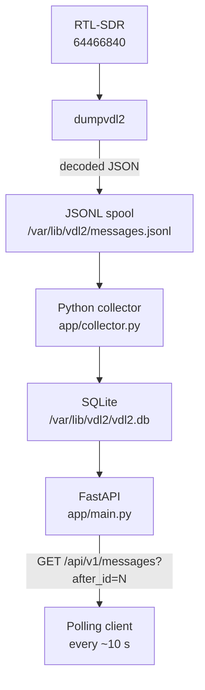
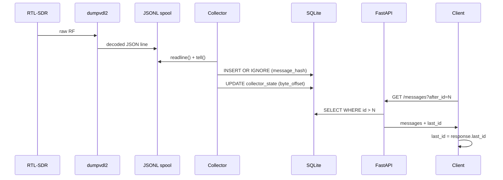

# VDL2 API

> A lightweight Python service for Raspberry Pi that collects decoded VDL Mode 2 aviation messages from `dumpvdl2`, stores them persistently in SQLite, and exposes them through a REST API.


---

## What is VDL Mode 2?

VDL Mode 2 (VHF Digital Link Mode 2) is a digital datalink protocol used by commercial aircraft to exchange operational messages with ground stations over VHF radio. It carries ACARS messages (position reports, weather, clearances), CPDLC (Controller–Pilot Data Link Communications), ADS-C position reports, and other aviation data. It operates on frequencies between 136 and 137 MHz and is receivable with an inexpensive RTL-SDR dongle and the open-source `dumpvdl2` decoder.

This service sits between `dumpvdl2` and any application that wants to consume the decoded messages — a dashboard, a logger, a feed aggregator, or a custom analysis tool.

---

## Features

- **No-loss polling** — messages are stored permanently and retrieved by cursor (`after_id`), not by timestamp window. A client that stops polling for an hour resumes exactly where it left off.
- **Duplicate protection** — SHA-256 hash of each raw message prevents duplicates if the spool is replayed after a crash.
- **File rotation handling** — detects `dumpvdl2`'s hourly JSONL rotation by inode comparison and drains the old file before switching.
- **Crash recovery** — byte-offset checkpoint persisted to SQLite after every line; restarts resume without re-reading the whole file.
- **Raw JSON preservation** — the complete original `dumpvdl2` JSON is stored verbatim. Future field additions require no schema changes.
- **Optional API key authentication** — disabled by default; enabled by setting `VDL2_API_KEY`.
- **Configurable CORS** — for browser-based dashboard clients.
- **systemd integration** — hardened service units with `ProtectSystem`, `ProtectHome`, `PrivateTmp`.

---

## Architecture



---

## Requirements

- Raspberry Pi (or any Linux host) running Raspberry Pi OS / Debian
- Python 3.11+
- `dumpvdl2` 2.7.0 with `libacars` 2.2.1
- RTL-SDR (Nooelec NESDR SMArt v5, serial `64466840`)

---

## Installation

### 1. Create a dedicated user and data directory

```bash
sudo useradd -r -s /usr/sbin/nologin vdl2
sudo mkdir -p /var/lib/vdl2
sudo chown vdl2:vdl2 /var/lib/vdl2

# Allow the vdl2 user to access the RTL-SDR device
sudo usermod -aG plugdev vdl2
```

### 2. Install the application

```bash
sudo mkdir -p /opt/vdl2-api
sudo chown vdl2:vdl2 /opt/vdl2-api

git clone https://github.com/disappointingsupernova/vdl2-api /opt/vdl2-api
cd /opt/vdl2-api

python3 -m venv venv
venv/bin/pip install -r requirements.txt
```

### 3. Configure the environment

```bash
sudo cp /opt/vdl2-api/.env.example /opt/vdl2-api/.env
sudo chown vdl2:vdl2 /opt/vdl2-api/.env
sudo chmod 640 /opt/vdl2-api/.env
sudo nano /opt/vdl2-api/.env
```

Key variables:

| Variable | Default | Description |
|---|---|---|
| `VDL2_API_HOST` | `0.0.0.0` | Bind address |
| `VDL2_API_PORT` | `5001` | HTTP port |
| `VDL2_DATABASE` | `/var/lib/vdl2/vdl2.db` | SQLite database path |
| `VDL2_SPOOL` | `/var/lib/vdl2/messages.jsonl` | dumpvdl2 JSONL output |
| `VDL2_RETENTION_DAYS` | `30` | Message retention period |
| `VDL2_CORS_ORIGINS` | _(empty)_ | Comma-separated allowed CORS origins |
| `VDL2_API_KEY` | _(empty)_ | X-API-Key value; empty disables authentication |

### 4. Install systemd units

```bash
sudo cp /opt/vdl2-api/systemd/dumpvdl2.service /etc/systemd/system/
sudo cp /opt/vdl2-api/systemd/vdl2-api.service /etc/systemd/system/
sudo systemctl daemon-reload
```

### 5. Enable and start the services

```bash
sudo systemctl enable --now dumpvdl2.service
sudo systemctl enable --now vdl2-api.service
```

### 6. Verify

```bash
sudo systemctl status dumpvdl2.service
sudo systemctl status vdl2-api.service
journalctl -u vdl2-api.service -f
```

---

## API reference

Interactive documentation is available at:

```
http://<host>:5001/docs
http://<host>:5001/openapi.json
```

### Polling pattern

The intended client algorithm uses a persistent cursor:

```
last_id = 0

every 10 seconds:
    GET /api/v1/messages?after_id=<last_id>
    process all returned messages
    last_id = response.last_id
```

Messages are never deleted because a client has not fetched them. The cursor is a database `id`, not a timestamp window.

---

### `GET /api/v1/messages`

Return messages with `id > after_id`.

| Parameter | Type | Default | Description |
|---|---|---|---|
| `after_id` | int | `0` | Cursor — return messages after this id |
| `limit` | int | `500` | Max messages to return (max 5000) |
| `since` | string | — | ISO 8601 UTC lower bound on `received_at` |
| `until` | string | — | ISO 8601 UTC upper bound on `received_at` |
| `icao` | string | — | Filter by source or destination ICAO |
| `frequency` | int | — | Filter by frequency in Hz |

```bash
curl "http://adsb-pi:5001/api/v1/messages?after_id=18452&limit=1000"
```

```json
{
  "messages": [
    {
      "id": 18453,
      "timestamp": "2026-08-16T16:24:09.000Z",
      "timestamp_ms": 1786897449000,
      "ingested_at": "2026-08-16T16:24:09.181Z",
      "station_id": "adsb-pi",
      "frequency_hz": 136975000,
      "source": { "icao": "4CADF7", "type": "Aircraft" },
      "destination": { "icao": "1099CA", "type": "Ground station" },
      "direction": "downlink",
      "message_type": "H1",
      "aircraft_registration": "EIEXS",
      "flight_id": "EI501",
      "message_text": "#DFB/WRG POSRPT",
      "raw": {}
    }
  ],
  "count": 1,
  "first_id": 18453,
  "last_id": 18453,
  "has_more": false
}
```

---

### `GET /api/v1/messages/latest`

Return the newest N messages.

```bash
curl "http://adsb-pi:5001/api/v1/messages/latest?limit=50"
```

---

### `GET /api/v1/aircraft/{icao}/messages`

Messages for a specific aircraft. ICAO is canonicalised to uppercase.

```bash
curl "http://adsb-pi:5001/api/v1/aircraft/4CADF7/messages?limit=100"
```

---

### `GET /api/v1/aircraft`

Aircraft observed recently.

```bash
curl "http://adsb-pi:5001/api/v1/aircraft?hours=24"
```

```json
{
  "aircraft": [
    {
      "icao": "4CADF7",
      "first_seen": "2026-08-16T15:52:02.000Z",
      "last_seen": "2026-08-16T16:24:15.000Z",
      "message_count": 37,
      "registration": "EIEXS",
      "flight_id": "EI501"
    }
  ]
}
```

---

### `GET /api/v1/health`

```bash
curl "http://adsb-pi:5001/api/v1/health"
```

```json
{
  "status": "ok",
  "database": "ok",
  "collector": "ok",
  "last_message_at": "2026-08-16T16:24:15.000Z",
  "last_message_age_seconds": 3.1,
  "total_messages": 18454
}
```

---

### `GET /api/v1/stats`

```bash
curl "http://adsb-pi:5001/api/v1/stats"
```

```json
{
  "messages_total": 18454,
  "messages_last_minute": 32,
  "messages_last_hour": 1678,
  "messages_by_frequency": {
    "136725000": 182,
    "136775000": 401,
    "136825000": 307,
    "136875000": 855,
    "136975000": 16709
  },
  "unique_aircraft_last_hour": 141
}
```

---

## Authentication

By default the API is open. To require an API key on all requests:

```bash
# Generate a key
python3 -c "import secrets; print(secrets.token_hex(32))"

# Add to .env
VDL2_API_KEY=your-generated-key
```

Pass the key in the `X-API-Key` header:

```bash
curl -H "X-API-Key: your-generated-key" "http://adsb-pi:5001/api/v1/messages"
```

---

## Running tests

```bash
pip install -r requirements-dev.txt
pytest -v
```

---

## Project layout

```
/opt/vdl2-api/
├── app/
│   ├── main.py          # FastAPI app factory, lifespan, CORS, auth wiring
│   ├── config.py        # Pydantic settings (VDL2_* env vars)
│   ├── database.py      # SQLAlchemy ORM models, engine factory, get_session()
│   ├── models.py        # Shared ORM query helper (query_messages)
│   ├── schemas.py       # Pydantic response models
│   ├── collector.py     # JSONL spool tailer, checkpoint, rotation, retention
│   ├── parser.py        # dumpvdl2 JSON field extraction and hashing
│   ├── auth.py          # X-API-Key authentication dependency
│   └── routes/
│       ├── messages.py
│       ├── aircraft.py
│       ├── stats.py
│       └── health.py
├── systemd/
│   ├── dumpvdl2.service
│   └── vdl2-api.service
├── tests/
│   ├── fixtures/
│   │   └── sample_messages.jsonl
│   ├── test_database.py
│   ├── test_parser.py
│   ├── test_collector.py
│   ├── test_api.py
│   └── test_auth.py
├── AGENTS.md            # AI agent context
├── CHANGELOG.md
├── CONTRIBUTING.md
├── .env.example
├── requirements.txt
├── requirements-dev.txt
└── README.md
```

---

## Data flow and reliability



Key reliability properties:

- The collector checkpoints its byte offset after every line, so a restart resumes exactly where it left off.
- `INSERT OR IGNORE` on `message_hash` prevents duplicates if the spool is replayed.
- The API cursor is a monotonically increasing database `id`, not a timestamp. A client that stops polling for an hour simply resumes from its last `last_id`.
- Messages are retained for 30 days (configurable) regardless of whether any client has fetched them.

---

## Upgrading dumpvdl2

The raw dumpvdl2 JSON is stored verbatim in `raw_json`. If a new version of dumpvdl2 adds fields, they are automatically preserved without any schema change to the application.

---

## Contributing

See [CONTRIBUTING.md](CONTRIBUTING.md).

---

## Built with AI assistance

This project was developed with the assistance of [Amazon Q Developer](https://aws.amazon.com/q/developer/), an AI coding assistant built by AWS. The architecture, implementation, tests, and documentation were produced through an iterative conversation between the author and the AI — the author directed requirements, reviewed all output, and made all final decisions.

The use of AI tooling is disclosed here in the spirit of transparency. The code has been reviewed, tested (48 automated tests), and is the responsibility of the project maintainer.

---

## Licence

Apache 2.0 — see [LICENSE](LICENSE).
